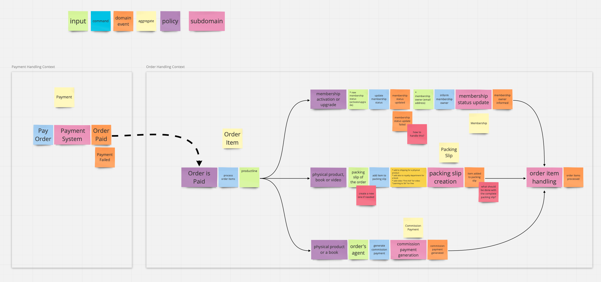
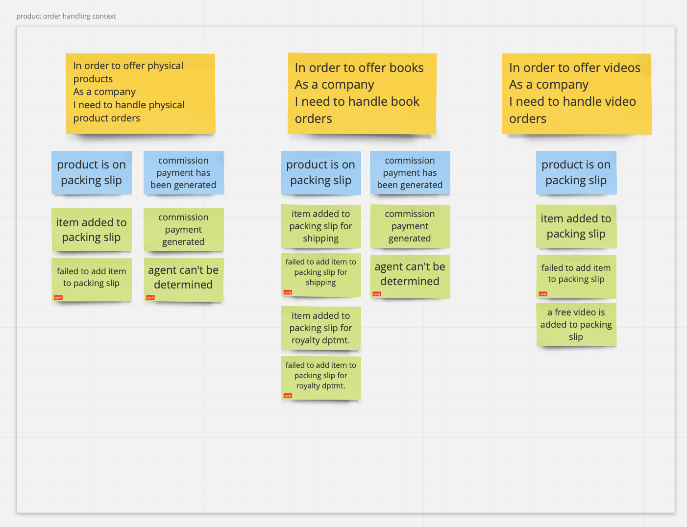
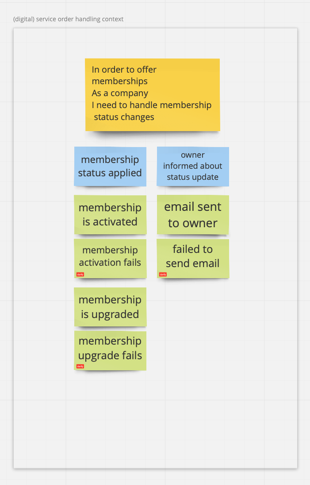

## Objectives

1. Model the requirements with the [event storming] approach.
2. Derive a scenario based specification in BDD style (Given-When-Then) from that model.
3. Let this specification drive your solution as a code model.

# Results

